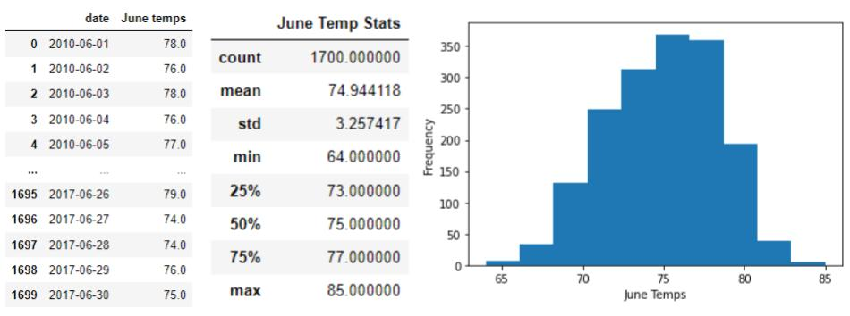
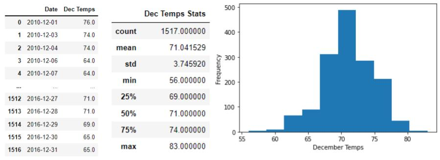
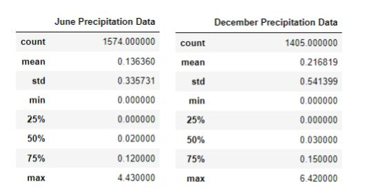
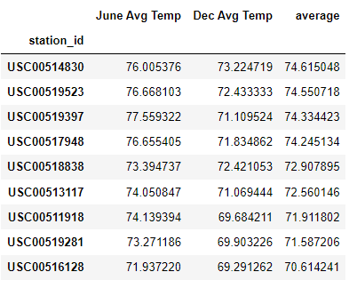
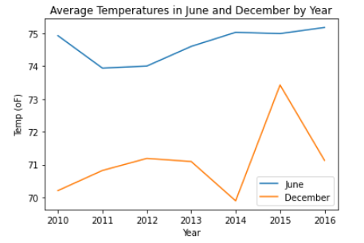

# Written Analysis of the 'Surfs Up'  weather data
## Overview
In this analysis, we looked at weather data for the months of June and December in Oahu, Hawaii.  We were trying to see if Oahu was a good location to open up a "Surf n' Shake" shop.

 
## Resources 
### -Data Source: "sqlite:///hawaii.sqlite"
  

## Results 
### 
### Deliverable 1: Summary Statistics for June Temperatures 
For this deliverable, our goal was to query all the temperature data for the month of June.  We then converted those temperatures to a list, created a DataFrame from the list, and then generated summary statistics.  In addition, I added a histogram to showcase the data.  

### Deliverable 2: Summary Statistics for December Temperatures 
For this deliverable, all of the same objectives as in the previous were repeated except for December this time.  

### Extra Query #1: Summary Statistics for June & December's Precipitation
Previously, we had looked at precipitation data for the entire year.  To truly compare June and December, I thought it was also important to look at those months individually for precipitation. 

### Key differences in weather between June and December
* June's maximum temperature of 85oF wasn't that different from December's maximum temperature of 83oF.
*  June's minimum temperature of 64oF however was quite higher than December's minimum temperature of 56oF.
* June and December's average temperatures were just a little different. June's average temperature was 74.9oF and December's average temperature was 71.0oF 
* The precipitation data showed that it definitely rains more in December than June, but again the data wasn't drastically different. 
 

### Extra Query #2: Temperatures by Locations in Oahu
I decided to also run a query to show the temperatures by location of the stations that collected data. I did this separately  for June and December and then I merged the data in one DataFrame.  I also found the average of June and December data.

 

## Summary
All of this data shows that the weather is good year-round! I did two extra queries that I thought would help the investor feel more confident about this business opportunity   In addition to weather data, I think it would be important to investigate other factors such as competing businesses and the best location by weather, popularity, and cost. 

### Further analysis #1 
Since there were 9 stations collecting data, I also did a "groupby" date to see that average temperature by date.

   

The summary statistics did change but not by a significant amount.

### Further analysis #2 
I also thought it was important to groupby "year". Here is a line graph to show the averages temperatures  by month over the years. 

